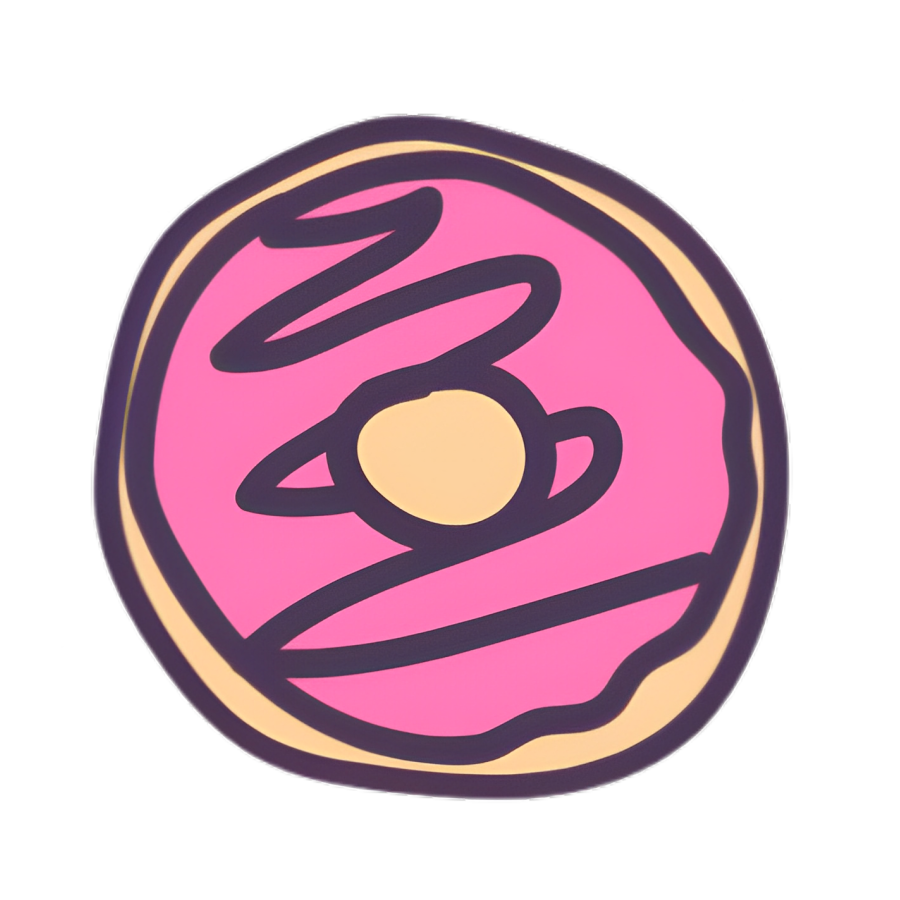

#  Donnut: Sweeten the Web!

**Tagline:** _Fueling Creativity, One Sweet Byte at a Time._

---

## Hey there, Digital Giver & Creative Soul! 👋

Ever wanted to send a little "thank you" to your favorite streamer, artist, writer, or indie developer, but crypto felt like a whole different universe? Or are you a creator dreaming of a simpler way to receive support from your global fanbase without juggling a dozen wallets?

Enter **Donnut** – the delightfully simple way to give and receive crypto donations, making the entire experience a treat for everyone involved! We're here to break down barriers, sprinkle some joy, and make supporting the creators you love easier and more rewarding than ever.

---

## Tech Stack

Donnut is built with modern web technologies and blockchain infrastructure:

- **Frontend**: Next.js 14, TypeScript, Tailwind CSS
- **Backend**: Next.js API Routes, Neon PostgreSQL
- **Blockchain**: EVM networks (Ethereum, Arbitrum, Optimism, Polygon)
- **Key Integrations**: 1inch Fusion+, Blockscout, Privy

  

    
    
    
  

For a detailed breakdown of our technology stack, see [Tech Stack Documentation](docs/tech-stack.md).

---

## Why is Donnut So Awesome? (Glad you asked!) 😋

Donnut isn't just another platform; it's a whole new flavor of support! We've cooked up something special to solve real problems for fans and creators:

* **Freedom of Flavor (Donate Any Crypto, From Any Chain!):**
    Got some ETH on Ethereum? DAI on Polygon? No problem! Fans can send donations using virtually *any cryptocurrency* from *any blockchain*. No more "Oops, wrong token!" moments. We use Blockscout to discover all available tokens on each chain (with spam filtering for a better experience).
* **One Sweet Reward for Creators (Hello, USDC on Your Preferred Chain!):**
    Creators, rejoice! Forget managing countless tokens and wallets. All those diverse fan donations magically transform into USDC (a stable, reliable digital dollar) and land right in your wallet on your preferred chain. By default, we use Arbitrum, but you can choose any supported chain!
* **Multiple Links for Different Purposes:**
    Creators can create and manage multiple donation links, each with its own label. Perfect for organizing donations for different projects, platforms, or purposes. All links are stored securely in our Neon PostgreSQL database.
* **Smart Analytics Dashboard:**
    Keep track of your success! Our creator dashboard provides detailed statistics about your donations, including transaction history per link and overall performance metrics. All transaction data is sourced directly from Blockscout for complete transparency.
* **Baked with Transparency (See it All!):**
    No hidden ingredients here! Every step of the donation journey is visible and verifiable through Blockscout. Trust is our main ingredient.
* **No Secret Recipe (Easy for Everyone!):**
    New to crypto? No worries! Donnut boasts an intuitive web app. The donation form is as simple as choosing a token, amount, and adding your message. We make Web3 feel like a walk in the park (or a trip to the donut shop!).
* **More Crumbs for Creators, Fewer Bites for Fees:**
    Traditional platforms can take a hefty slice. Donnut uses 1inch Fusion+ for optimized token conversion, minimizing commission bites and ensuring you get the best rates possible.

---

## How Donnut Helps Society (It's Bigger Than Just Donuts!) 🌍💖

We believe that by making support simpler and more joyful, we can make a real difference:

1.  **Fueling the Creator Economy:**
    Creators are the lifeblood of modern culture, education, and entertainment. Donnut provides them with a more accessible, stable, and efficient way to earn a living, allowing them to dedicate more time to creating the amazing content we all love.
2.  **Building Bridges, Not Walls (Connecting Web2 & Web3):**
    Many people are curious about Web3 but find it daunting. Donnut acts as a friendly guide, offering a practical and enjoyable way for millions of Web2 users to experience the benefits of blockchain technology without needing a PhD in cryptography.
3.  **Empowering Global Support & Financial Inclusion:**
    Donnut transcends borders. It allows fans from anywhere in the world to support creators, and for creators to receive that support in a stable currency, regardless of local banking limitations. It's a step towards a more inclusive financial future for creatives.
4.  **Fostering Genuine Connection & Community:**
    By enabling personalized messages with donations, Donnut helps build stronger, more meaningful relationships between creators and their audiences. It's about celebrating shared passions and mutual appreciation.
5.  **Promoting Transparency and Trust in Online Giving:**
    In a world where trust can be scarce, Donnut champions transparency. By making all transactions verifiable through Blockscout, we aim to set a new standard for integrity in online support platforms.

---

## Roadmap 🗺️ (Coming Soon!)

Get ready for even more sweetness! Here's what's baking in our kitchen:

* **Support More Chains (Expanding Our Recipe Book!):**
    We're cooking up support for more EVM chains to give you even more options for sending and receiving donations. More chains mean more flexibility and lower fees for everyone!

* **Support Non-EVM Blockchains (New Flavors in the Mix!):**
    Why stop at EVM? We're excited to bring the Donnut experience to other blockchain ecosystems. This means more options, more users, and more opportunities for creators worldwide!

* **Win the "Golden Sprinkle"! (Random NFT Bonuses!):**
    Who doesn't love a surprise? We're implementing Pyth Entropy to randomly select donations to receive awesome bonuses, like unique NFT tokens on Flow! It's our way of adding an extra dash of excitement and giving back to our amazing community of givers.

* **Add Your Personal Sprinkle (Messages That Stick!):**
    A donation is sweet, but a donation with a lasting message? That's even sweeter! Soon, fans will be able to attach messages to their "donnuts" that will be stored permanently and transparently on Filecoin. Your words of encouragement and support will be preserved forever on the blockchain!

* **And More Toppings Coming Soon...** 🎨
    Stay tuned! We're always cooking up new features and improvements. Got a sweet idea for Donnut? We'd love to hear it! Our kitchen is always open for suggestions to make the platform even more delightful.

---

## Join the Donnut Movement! 🚀

Whether you're a fan eager to share some love, or a creator ready to receive support in the simplest way possible, Donnut is for you.

* **Try the App:** https://donnut.vercel.app/

Let's make the internet a sweeter, more supportive place for creators, together!

  
  
  
  
  

