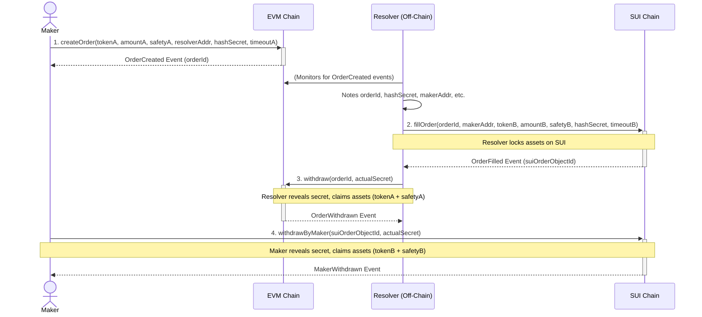

# EVM-SUI Cross-Chain Escrow - Resolver Demo

This directory contains a demonstration script (`happyPathDemo.ts`) that simulates the "happy path" for a cross-chain atomic swap using the EVM and SUI escrow contracts located in the parent `escrow-base` directory.

## Overview

The demo showcases how a "Maker" can initiate an asset transfer from an EVM-compatible chain to the SUI blockchain, and how a "Resolver" facilitates this by mirroring the order on the SUI chain. The process ensures atomicity through a shared hashed secret.

The `happyPathDemo.ts` script simulates the actions of:

1.  **The Maker:** Initiates the escrow on the EVM chain. Later, withdraws assets on the SUI chain.
2.  **The Resolver:** An off-chain entity (simulated by the script) that:
    - Monitors the EVM chain for new escrow orders.
    - Fills the corresponding order on the SUI chain by locking assets.
    - Withdraws the Maker's assets from the EVM escrow using the secret.

## System Architecture & Flow

The system involves three main components:

1.  **EVM Chain:** Hosts the `FusionEscrowSource.sol` contract where the Maker locks initial assets (ERC20 tokens + native gas token as safety deposit).
2.  **SUI Chain:** Hosts the `fusion_escrow_destination.move` module where the Resolver locks corresponding assets (SUI tokens + SUI as safety deposit).
3.  **Resolver Script (`happyPathDemo.ts`):** An off-chain TypeScript application that orchestrates the interactions between the two chains, simulating both Maker and Resolver roles for the demo.

### Happy Path Sequence Diagram



### Detailed Flow Explanation:

1.  **Maker Creates Order on EVM:**

    - The Maker calls `createOrder` on the `FusionEscrowSource` contract on the EVM chain.
    - They specify the ERC20 token and amount to send, a safety deposit (in native EVM currency like ETH), the Resolver's EVM address, a hash of a secret (`hashSecret`), and a timeout period.
    - The contract locks the Maker's tokens and safety deposit. An `OrderCreated` event is emitted.

2.  **Resolver Fills Order on SUI:**

    - The (simulated) Resolver detects the `OrderCreated` event on the EVM chain.
    - The Resolver calls `fill_order` on the `fusion_escrow_destination` module on the SUI chain.
    - They use the same `orderIdGlobal` (derived from the EVM `orderId`), the Maker's address, the SUI equivalent token and amount, a safety deposit in SUI, the _same_ `hashSecret`, and a timeout.
    - The SUI module locks the Resolver's SUI assets. An `OrderFilled` event is emitted.

3.  **Resolver Withdraws from EVM:**

    - Having fulfilled their part on the SUI chain, the Resolver now knows the `actualSecret`.
    - The Resolver calls `withdraw` on the `FusionEscrowSource` (EVM) contract, providing the `orderId` and the `actualSecret`.
    - If the secret is correct and the order hasn't timed out, the EVM contract transfers the Maker's locked tokens and safety deposit to the Resolver. An `OrderWithdrawn` event is emitted.

4.  **Maker Withdraws from SUI:**
    - The Maker (who also knows the `actualSecret`) can now call `withdraw_by_maker` on the `fusion_escrow_destination` (SUI) module.
    - They provide the SUI order object ID (or `orderIdGlobal`) and the `actualSecret`.
    - If the secret is correct and the SUI order hasn't timed out (for the Maker's withdrawal window), the SUI module transfers the Resolver's locked SUI assets (token and safety deposit) to the Maker. A `MakerWithdrawn` event is emitted.

This completes the cross-chain swap.

## `happyPathDemo.ts` Script

This script automates the four phases described above:

- Sets up EVM and SUI providers and signers for Maker and Resolver.
- Generates a secret and its hash.
- **Phase 1:** Deploys `MockERC20` and `FusionEscrowSource` contracts to the EVM chain. The Maker then creates an order.
- **Phase 2:** Assumes SUI modules are pre-published (requires manual step). The Resolver then fills the corresponding order on the SUI chain. (Currently uses SUI as the mock token on the SUI side for simplicity).
- **Phase 3:** The Resolver withdraws assets from the EVM escrow.
- **Phase 4:** The Maker withdraws assets from the SUI escrow.

The script uses `ethers.js` for EVM interactions and `@mysten/sui.js` for SUI interactions.

## Prerequisites

- Node.js (e.g., v18 or later)
- `pnpm` package manager (or npm/yarn, but instructions below use pnpm)
- Hardhat CLI (for EVM contract compilation): `pnpm add -g hardhat` (or `npm install -g hardhat`)
- Sui CLI (for SUI module publishing): Follow official SUI installation guide.
- A local EVM node running (e.g., `npx hardhat node` in `escrow-base/escrow-base-evm/`).
- A local SUI node running (e.g., `sui start`).

## Setup Instructions

1.  **Navigate to the Resolver Directory:**
    From the root of the `donnut` project:

    ```bash
    cd escrow-base/Resolver
    ```

2.  **Install Dependencies:**

    ```bash
    pnpm install
    ```

3.  **Compile EVM Contracts:**
    Navigate to the EVM contract directory and compile:

    ```bash
    cd ../escrow-base-evm
    npx hardhat compile
    cd ../Resolver
    ```

    This generates the ABI and bytecode artifacts needed by the demo script.

4.  **Publish SUI Modules:**
    Navigate to the SUI package directory and publish it to your local SUI network:

    ```bash
    cd ../escrow-base-sui/fusion_escrow
    sui client publish --gas-budget 100000000 .
    ```

    Take note of the **Package ID** from the output. You will need this for the `.env` file. After publishing, return to the Resolver directory:

    ```bash
    cd ../../Resolver
    ```

5.  **Create and Configure `.env` File:**
    In the `escrow-base/Resolver_EVM->SUI/` directory, copy the example environment file:

    ```bash
    cp .env.example .env
    ```

    Then, open the newly created `.env` file and update the placeholder values with your actual data, especially:

    - `SUI_PACKAGE_ID`: The Package ID obtained after publishing the SUI modules.
    - `MAKER_SEED_PHRASE_SUI`: The hex-encoded private key for the Maker's SUI account.
    - `RESOLVER_SEED_PHRASE_SUI`: The hex-encoded private key for the Resolver's SUI account.

    The file contains comments explaining each variable. Ensure the SUI accounts are funded on your target SUI network. The default EVM private keys correspond to Hardhat's default accounts.

## Running the Demo

Once all setup steps are complete and your local EVM and SUI nodes are running:

1.  Navigate to the `escrow-base/Resolver_EVM->SUI/` directory (if not already there).
2.  Run the script using `pnpm`:
    ```bash
    pnpm start
    ```

The script will log its progress through the different phases of the cross-chain escrow.

## Key Configuration Variables (in `.env`)

- `SUI_PACKAGE_ID`: The ID of your published SUI escrow package.
- `MAKER_SEED_PHRASE_SUI`: Seed phrase for the Maker's SUI account.
- `RESOLVER_SEED_PHRASE_SUI`: Seed phrase for the Resolver's SUI account.
- `EVM_RPC_URL` (optional, defaults to `http://127.0.0.1:8545`): RPC URL for the EVM chain.
- `MAKER_PRIVATE_KEY_EVM` (optional, defaults to Hardhat account 0 key): Private key for the Maker's EVM account.
- `RESOLVER_PRIVATE_KEY_EVM` (optional, defaults to Hardhat account 1 key): Private key for the Resolver's EVM account.
- `SUI_RPC_URL` (optional, defaults to `http://127.0.0.1:9000`): RPC URL for the SUI chain.

This demo provides a foundational script for understanding and testing the cross-chain escrow logic.
