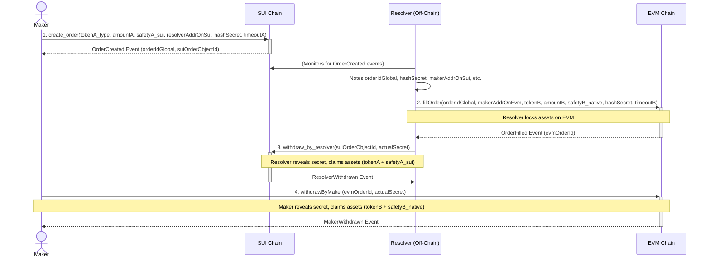

# SUI-EVM Cross-Chain Escrow - Resolver Demo

This directory contains a demonstration script (`happyPathDemoSuiToEvm.ts`) that simulates the "happy path" for a cross-chain atomic swap using the SUI and EVM escrow contracts located in the parent `escrow-base` directory.

## Overview

The demo showcases how a "Maker" can initiate an asset transfer from the SUI blockchain to an EVM-compatible chain, and how a "Resolver" facilitates this by mirroring the order on the EVM chain. The process ensures atomicity through a shared hashed secret.

The `happyPathDemoSuiToEvm.ts` script simulates the actions of:

1.  **The Maker:** Initiates the escrow on the SUI chain. Later, withdraws assets on the EVM chain.
2.  **The Resolver:** An off-chain entity (simulated by the script) that:
    - Monitors the SUI chain for new escrow orders.
    - Fills the corresponding order on the EVM chain by locking assets.
    - Withdraws the Maker's assets from the SUI escrow using the secret.

## System Architecture & Flow

The system involves three main components:

1.  **SUI Chain:** Hosts the `fusion_escrow_source.move` module where the Maker locks initial assets (SUI tokens + SUI as safety deposit).
2.  **EVM Chain:** Hosts the `FusionEscrowDestination.sol` contract where the Resolver locks corresponding assets (ERC20 tokens + native gas token as safety deposit).
3.  **Resolver Script (`happyPathDemoSuiToEvm.ts`):** An off-chain TypeScript application that orchestrates the interactions between the two chains, simulating both Maker and Resolver roles for the demo.

### Happy Path Sequence Diagram



### Detailed Flow Explanation:

1.  **Maker Creates Order on SUI:**
    - The Maker calls `create_order` on the `fusion_escrow_source` module on the SUI chain.
    - They specify the SUI token type and amount to send, a safety deposit (in SUI), the Resolver's SUI address, a hash of a secret (`hashSecret`), and a timeout period.
    - The module locks the Maker's SUI assets and safety deposit. An `OrderCreated` event is emitted (via a dynamic field object representing the order).

2.  **Resolver Fills Order on EVM:**
    - The (simulated) Resolver detects the `OrderCreated` event on the SUI chain.
    - The Resolver calls `fillOrder` on the `FusionEscrowDestination` contract on the EVM chain.
    - They use the `orderIdGlobal` (from the SUI order), the Maker's EVM address, the ERC20 token and amount, a safety deposit in native EVM currency, the _same_ `hashSecret`, and a timeout.
    - The EVM contract locks the Resolver's ERC20 tokens and safety deposit. An `OrderFilled` event is emitted.

3.  **Resolver Withdraws from SUI:**
    - Having fulfilled their part on the EVM chain, the Resolver now knows the `actualSecret`.
    - The Resolver calls `withdraw_by_resolver` on the `fusion_escrow_source` (SUI) module, providing the SUI order object ID and the `actualSecret`.
    - If the secret is correct and the order hasn't timed out, the SUI module transfers the Maker's locked SUI assets and safety deposit to the Resolver. A `ResolverWithdrawn` event is emitted (via order object state change).

4.  **Maker Withdraws from EVM:**
    - The Maker (who also knows the `actualSecret`) can now call `withdrawByMaker` on the `FusionEscrowDestination` (EVM) contract.
    - They provide the EVM order ID (or `orderIdGlobal`) and the `actualSecret`.
    - If the secret is correct and the EVM order hasn't timed out (for the Maker's withdrawal window), the EVM contract transfers the Resolver's locked ERC20 tokens and safety deposit to the Maker. A `MakerWithdrawn` event is emitted.

This completes the cross-chain swap.

## `happyPathDemoSuiToEvm.ts` Script

This script automates the four phases described above:

- Sets up SUI and EVM providers and signers for Maker and Resolver.
- Generates a secret and its hash.
- **Phase 1:** Assumes SUI modules are pre-published (requires manual step for `fusion_escrow_source`). The Maker then creates an order on the SUI chain. (Currently uses SUI as the mock token on the SUI side for simplicity).
- **Phase 2:** Deploys `MockERC20` and `FusionEscrowDestination` contracts to the EVM chain. The Resolver then fills the corresponding order on the EVM chain.
- **Phase 3:** The Resolver withdraws assets from the SUI escrow.
- **Phase 4:** The Maker withdraws assets from the EVM escrow.

The script uses `@mysten/sui.js` for SUI interactions and `ethers.js` for EVM interactions.

## Prerequisites

- Node.js (e.g., v18 or later)
- `pnpm` package manager (or npm/yarn, but instructions below use pnpm)
- Sui CLI (for SUI module publishing): Follow official SUI installation guide.
- Hardhat CLI (for EVM contract compilation): `pnpm add -g hardhat` (or `npm install -g hardhat`)
- A local SUI node running (e.g., `sui start`).
- A local EVM node running (e.g., `npx hardhat node` in `escrow-base/escrow-base-evm/`).

## Setup Instructions

1.  **Navigate to the Resolver Directory:**
    From the root of the `donnut` project:

    ```bash
    cd escrow-base/Resolver_SUI->EVM
    ```

2.  **Install Dependencies:**

    ```bash
    pnpm install
    ```

3.  **Publish SUI Modules (Source):**
    Navigate to the SUI package directory for `fusion_escrow` (which contains `fusion_escrow_source.move`) and publish it to your local SUI network:

    ```bash
    cd ../escrow-base-sui/fusion_escrow
    sui client publish --gas-budget 100000000 .
    ```

    Take note of the **Package ID** from the output. You will need this for the `.env` file. After publishing, return to the Resolver directory:

    ```bash
    cd ../../Resolver_SUI->EVM
    ```

4.  **Compile EVM Contracts (Destination):**
    Navigate to the EVM contract directory and compile (this will compile all contracts including `FusionEscrowDestination.sol`):

    ```bash
    cd ../escrow-base-evm
    npx hardhat compile
    cd ../Resolver_SUI->EVM
    ```

    This generates the ABI and bytecode artifacts needed by the demo script.

5.  **Create and Configure `.env` File:**
    In the `escrow-base/Resolver_SUI->EVM/` directory, copy the example environment file:

    ```bash
    cp .env.example .env
    ```

    Then, open the newly created `.env` file and update the placeholder values with your actual data, especially:

    - `SUI_PACKAGE_ID`: The Package ID obtained after publishing the SUI modules.
    - `MAKER_SEED_PHRASE_SUI`: The hex-encoded private key for the Maker's SUI account.
    - `RESOLVER_SEED_PHRASE_SUI`: The hex-encoded private key for the Resolver's SUI account.
    - `EVM_DESTINATION_CONTRACT_ADDRESS` (if pre-deployed, otherwise script deploys): Address of the `FusionEscrowDestination.sol` contract.
    - `MOCK_ERC20_ADDRESS` (if pre-deployed, otherwise script deploys): Address of the `MockERC20.sol` contract.


    The file contains comments explaining each variable. Ensure the SUI and EVM accounts are funded on your target networks. The default EVM private keys correspond to Hardhat's default accounts.

## Running the Demo

Once all setup steps are complete and your local SUI and EVM nodes are running:

1.  Navigate to the `escrow-base/Resolver_SUI->EVM/` directory (if not already there).
2.  Run the script using `pnpm`:
    ```bash
    pnpm start
    ```

The script will log its progress through the different phases of the cross-chain escrow.

## Key Configuration Variables (in `.env`)

- `SUI_RPC_URL` (optional, defaults to `http://127.0.0.1:9000`): RPC URL for the SUI chain.
- `MAKER_SEED_PHRASE_SUI`: Seed phrase for the Maker's SUI account.
- `RESOLVER_SEED_PHRASE_SUI`: Seed phrase for the Resolver's SUI account.
- `SUI_PACKAGE_ID`: The ID of your published SUI escrow package (containing `fusion_escrow_source.move`).
- `EVM_RPC_URL` (optional, defaults to `http://127.0.0.1:8545`): RPC URL for the EVM chain.
- `MAKER_PRIVATE_KEY_EVM` (optional, defaults to Hardhat account 0 key): Private key for the Maker's EVM account.
- `RESOLVER_PRIVATE_KEY_EVM` (optional, defaults to Hardhat account 1 key): Private key for the Resolver's EVM account.
- `EVM_DESTINATION_CONTRACT_ADDRESS` (optional): If `FusionEscrowDestination.sol` is already deployed.
- `MOCK_ERC20_ADDRESS` (optional): If `MockERC20.sol` is already deployed.

This demo provides a foundational script for understanding and testing the SUI-EVM cross-chain escrow logic.
